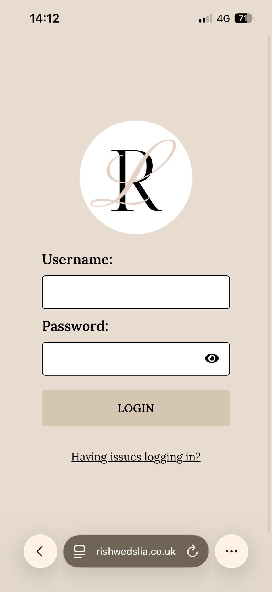
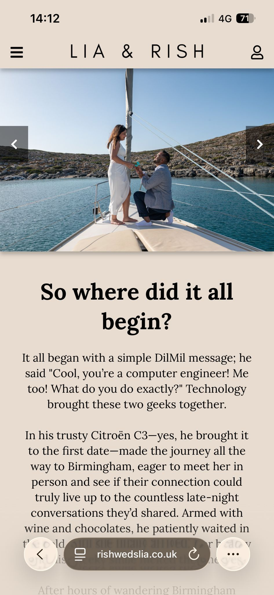
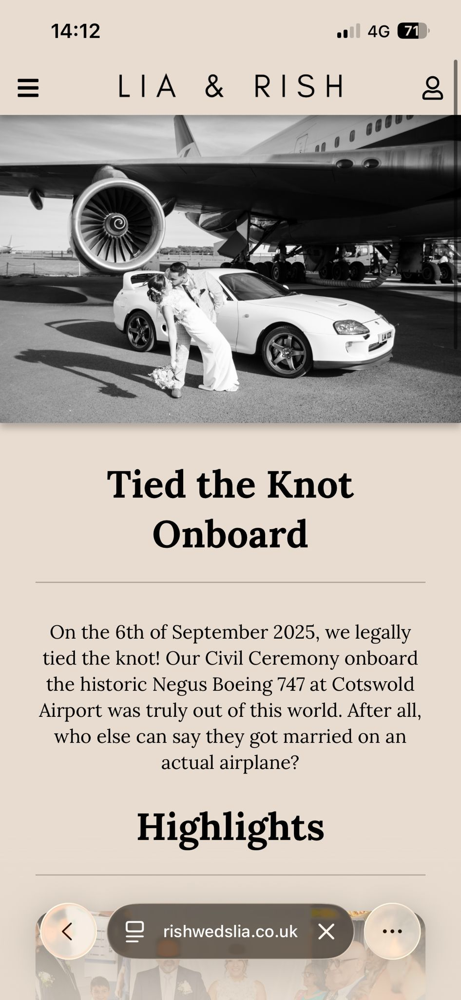
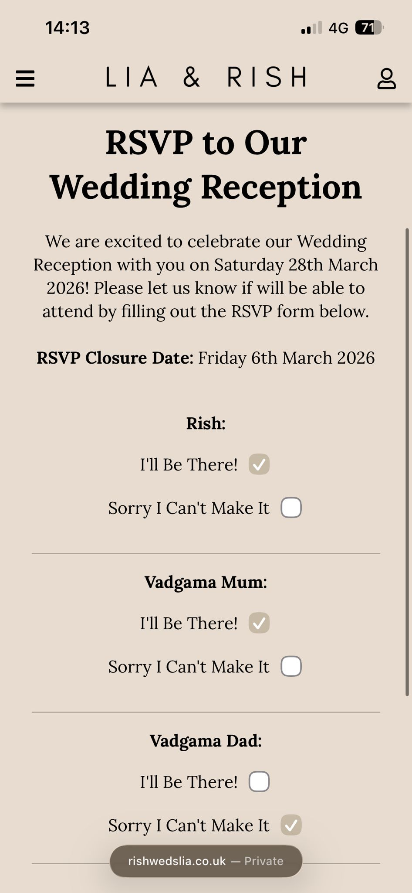
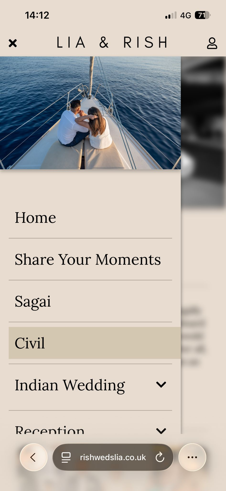
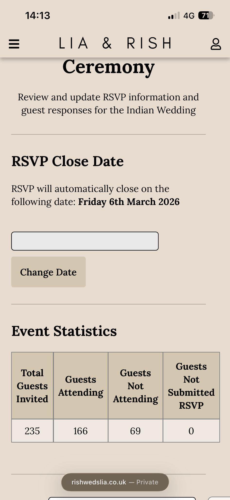

# Wedding Website & RSVP Management System

> **Portfolio Showcase**
> This repository showcases a bespoke event management website that I designed, developed and deployed for my own wedding. The source code is intentionally not included, as the application contains personal information and configuration that is not suitable for public release.

---

## Project Overview

The Wedding Website & RSVP Management System was developed to provide guests with a single place to access all information relating to our wedding while significantly reducing the administrative effort involved in managing invitations and guest responses.

Rather than relying on multiple third-party services or traditional paper RSVP cards, I designed and developed a bespoke web application that automated much of the process and provided a better experience for both guests and ourselves.

The application was successfully deployed to a live production environment and used throughout the wedding planning process by invited guests.

---

## Background

Planning a wedding involves managing a considerable amount of information, including:

* Guest invitations
* RSVP responses
* Venue information
* Accommodation recommendations
* Travel guidance
* Frequently asked questions
* Important event updates

Keeping this information organised while manually tracking RSVP responses would have been both time-consuming and prone to error.

As a software engineer, I saw this as an opportunity to develop a real-world solution to a genuine problem.

The result was a fully customised website that centralised event information while automating the RSVP process and simplifying guest management.

---

## Objectives

The project aimed to:

* Provide guests with a professional and easy-to-use website
* Centralise all wedding-related information
* Replace paper RSVP cards with an online submission process
* Automatically collect and manage guest responses
* Reduce manual administration during wedding planning
* Deploy a reliable production web application for real users

---

## Key Features

### Guest Portal

* Responsive website for desktop and mobile devices
* Wedding information and schedule
* Venue details
* Travel and accommodation guidance
* Frequently Asked Questions
* Online RSVP submission
* Contact information

### RSVP Management

* Online RSVP form
* Automatic recording of guest responses
* Attendance tracking
* Secure storage of submitted data

### Administration

* View guest responses
* Monitor attendance numbers
* Manage RSVP information
* Update website content as required

---

## Technologies Used

### Backend

* PHP

### Database

* MySQL

### Frontend

* HTML5
* CSS3
* JavaScript

### Hosting

* IONOS Web Hosting

---

## Skills Demonstrated

This project demonstrates experience with:

* Full-stack web development
* PHP application development
* MySQL database design
* Responsive web design
* Form handling and validation
* CRUD operations
* Production deployment
* Web hosting configuration
* Real-world requirements gathering
* Developing software for genuine end users

---

## Challenges

Developing this application required balancing technical implementation with usability for guests of varying technical ability.

Some of the key challenges included:

* Designing an intuitive user experience
* Ensuring the website worked well on mobile devices
* Creating a simple and reliable RSVP workflow
* Managing guest information securely
* Deploying and maintaining a live production website

---

## What I Learned

This project provided valuable experience in:

* Designing software around real user requirements
* Developing and deploying production-ready web applications
* Managing a complete software project from concept through to deployment
* Improving user experience through iterative development
* Supporting a live application throughout an active event planning process

---

## Screenshots

### Login Page

---

### Home Page

---

### Event Information

---

### RSVP Form

---

### Navigation Menu

---

### Event Management

---

## Project Outcome

The website was successfully deployed and used throughout the wedding planning process.

Guests were able to access event information online and submit RSVP responses digitally, significantly reducing the manual administration typically associated with organising a wedding.

Developing this project allowed me to apply software engineering principles to solve a genuine real-world problem while delivering a solution that was actively used by family and friends.

---

## Repository Purpose

Although the source code for this application is not publicly available, this repository exists to showcase the project as part of my software engineering portfolio.

It demonstrates my ability to gather requirements, design a solution, develop a full-stack web application and successfully deploy software for real users in a production environment.
